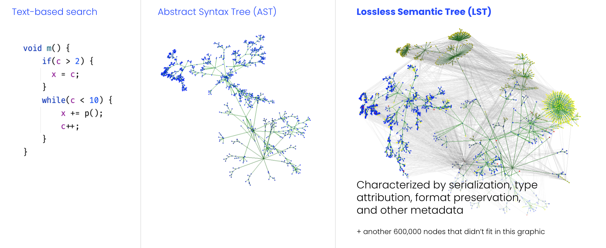

# Lossless Semantic Trees (LST)

<figure>
  
  <figcaption>_LST comparison_</figcaption>
</figure>

A Lossless Semantic Tree (LST) is a tree representation of code. Unlike the traditional [Abstract Syntax Tree](https://en.wikipedia.org/wiki/Abstract\_syntax\_tree) (AST), OpenRewrite's LST offers a unique set of characteristics that make it possible to perform accurate transformations and searches across a repository:

* **Type-attributed**. Each LST is imbued with type information. For example, when referencing a field, the source code may just refer to it as `myField`. The OpenRewrite LST for `myField`, on the other hand, would contain additional information about what the type of `myField` is, even if it isn't defined in the same source file or even the same project.
* **Format-preserving**. Whitespace before and after LSTs are preserved in the tree so the tree can be printed out to reconstitute the original source code without clobbering formatting. Additionally, refactoring operations that insert code are sensitive to the local style of the code around them and match the local style.

Type attribution is necessary for the accurate matching of patterns. For example, if we are looking for [SLF4J](http://www.slf4j.org/) log statements and we see a statement like the following, without type attribution how do we know if `logger` is an SLF4J or a Logback logger?

```java
logger.info("Hi");
```

Format preservation is necessary if formatting isn't 100% consistent throughout the whole repository.

:::info
If you want to see specific examples of OpenRewrite Java LSTs, please read our [Java LST Examples doc](lst-examples.md).&#x20;
:::


:::tip
[Moderne](https://docs.moderne.io/) adds additional functionality to support large-scale mass refactoring on LSTs. With Moderne, you can quickly make transformations across your entire organization.
:::

## LST lifecycle

When you run an OpenRewrite recipe locally:

1. The OpenRewrite process creates an LST which is stored in memory. This reflects the current state of the repository on disk.
2. The process continues by making transformations on the LST. This could be adding a search marker (`~~>`) if the recipe is a search recipe -- or it could be more significant code changes.
3. Once the recipe finishes running, the LST is converted back to text which then is used to overwrite any existing files that have changed.
4. After all of the files have been overwritten, the process ends. _Nothing is stored between recipe runs_. 
5. If you go to run another recipe after the first one is done, a new LST will be generated at that time.
6. If the previous recipe made changes and those changes exist locally, then the newly generated LST will have all of those changes. If the previous recipe made no changes, then the LST will effectively be the same one as before (but regenerated as the previous one no longer exists).

:::info
In order for OpenRewrite to work locally, the LST **must** fit into memory. This is in contrast with [Moderne](https://docs.moderne.io/) where the LST can be built and used in pieces.
:::
